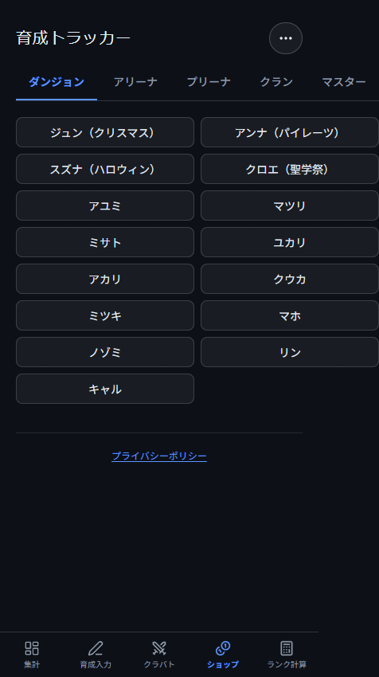
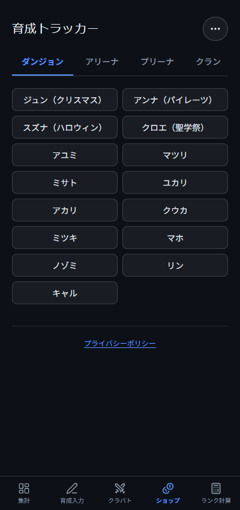

# ショップ幅・画面切り替えスクロールの検証

## 修正

- ショップのgrid項目（Tabs Root）を親幅まで縮小可能にし、タブ列の最小内容幅によるページ拡幅を解消。長い名前はセル内で折り返す。
- メイン画面を切り替えた後、描画前にページ先頭へ移動。初回表示・同じタブの再選択・同画面の編集では位置を変更しない。
- 選択編成は従来どおり保持。スクロール位置は保持対象外という [PR #32](https://github.com/eioh/pcre-tracker/pull/32) の仕様に従う。

## 検証条件・結果

Windows Chromeのヘッドレス実行によるCSS幅シミュレーション（高さ850px）。実機タッチ検証ではない。未ログイン・外部APIを遮断し、公開マスターと架空の編成60件を使用。ユーザーの私有JSONは使用していない。

| CSS幅 | ショップのページ幅（修正前→後） | 内容幅（修正後） | 集計への遷移後scrollY |
| --- | --- | --- | --- |
| 400px | 476→400px | 360px | 修正前1416→修正後0 |
| 768px | 768→768px | 728px | 0 |
| 1180px | 1180→1180px | 1140px | 0 |

ダンジョンとマスターの両方で測定。修正後は名前セルの横方向オーバーフロー0件。ショップはモバイル2列・768px以上4列を維持する。

スクロール手順：集計を事前表示して遅延読み込み済みにする→クラバトのTL下部へ移動→拡大表示→Esc→最下部へスクロール→集計。モバイルでは切替元scrollY=3513から0へ戻った。遷移先が未読み込みの場合は短いSuspenseフォールバックにより偶然先頭へ戻ることがあるため、読み込み済みで再現・確認した。

App回帰テストは修正前コードで2件とも失敗し、修正後は成功。初回表示・同画面再選択ではスクロールをリセットせず、別画面への往復で先頭へ戻ることをPC・モバイル双方で確認する。

どっと側クラウドブラウザでの私有JSONを使った再検証、実機タッチ、ログイン同期は未実施。本番デプロイ・リモートD1操作は行っていない。

## スクリーンショット

400px 修正前（ページ幅476px）:

400px 修正後:

[400pxマスター全体](after-400-master.png) / [768pxダンジョン](after-768-dungeon.png) / [1180pxダンジョン](after-1180-dungeon.png)

## 育成一覧の更新案内（追加修正）

調査後のユーザー合意に基づき、フィルタ条件の即時反映と編集時の行保持を維持し、従来の「表示に適用」をフィルタ設定の外へ移動した。適用済みの進捗と現在値に差がある間だけ「育成データが変更されています」と「一覧を更新」を表示する。PC・タブレットはテーブル直前、スマホはstickyツールバーに配置。更新すると最新の進捗で一覧を再評価し、案内を消す。

同値の再通知、フィルタだけの変更、編集を元に戻した場合には案内を出さない。再編集・再更新、親からの明示同期も回帰テストで検証。WindowsローカルChrome実画面（ヘッドレス、1180×850／768×850／400×850 CSS px）で、未所持349件の一覧に所持チェックを付けても349件を保持し、一覧更新後に348件となり案内が消えることを確認。3幅ともページ幅超過なし、ボタン高40px、画面内に表示。新UIの画像はLibraryで共有する。

## 「表示に適用」の履歴調査

- [a405c2c](https://github.com/eioh/pcre-tracker/commit/a405c2c8fb3b27def0d697369d8e9b2e0907aa8b)（2026-06-11）で設定値と進捗値の適用用スナップショットを導入。ボタンで現在のフィルタ・ソート設定と進捗を反映し、編集後も手動適用までソート順を維持するテストを追加した。編集による行移動・消失を抑える目的と読み取れる（コード・コメント・テストからの推定）。
- [d51c6fd](https://github.com/eioh/pcre-tracker/commit/d51c6fd002fa75a53b3110f411df20b75ea4e65b)（2026-06-15）で詳細設定を即時反映するよう変更。設定値の固定スナップショットは撤去し、進捗値の固定スナップショットのみ残した。
- 追加修正前の `handleApplyDisplaySettings` は `setAppliedProgressByName({ ...state.progressByName })` のみ。今回も同じ進捗スナップショット更新を `handleRefreshList` が担当する。条件の変更は即時反映、編集した進捗によるソート・絞り込みの再評価はボタン押下時。画面の値自体は最新進捗を表示する。
- 既存テストはフィルタの即時反映と編集後のソート順保持を明示しており、今回も維持。×はフィルタ変更のキャンセルではない。
- PR #4で同じフィルタUIをモバイルシートへ移動。PR #14でも即時反映の検証が記録されている。追加・即時反映の2commitに直接対応するPRは確認できなかった。

調査時の選択肢と今回の判断:

1. 即時フィルタを維持し、ボタンの役割を明示。ユーザー合意により、今回「一覧を更新」への改名・フィルタ外への移動・変更時のみ表示を実装した。
2. 進捗編集も即時再評価してボタンを廃止。編集中に行が移動・消失する影響の確認が必要。
3. フィルタを確定式に戻す。シートの下書き・確定・×キャンセル仕様が必要で、未承認の挙動変更になる。
